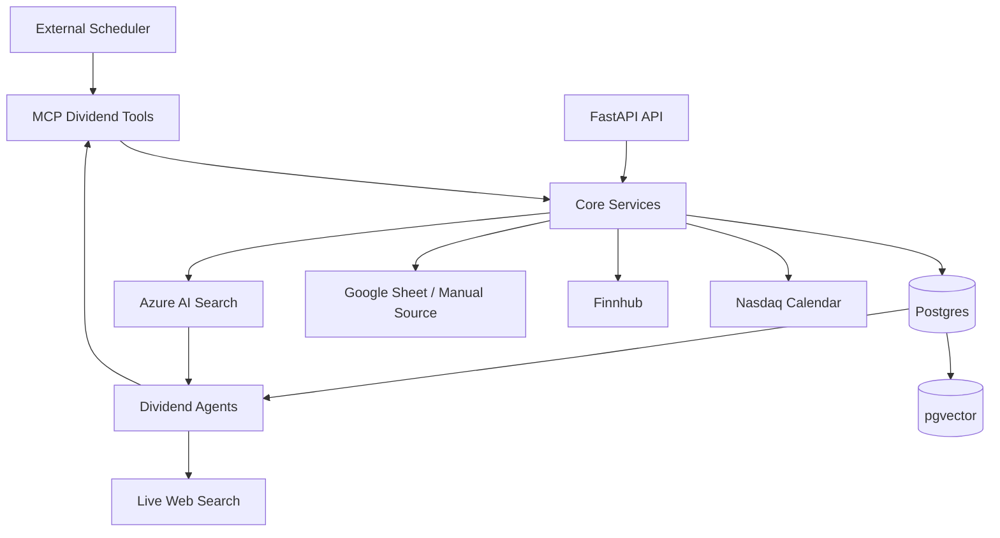

# Dividend System Review And Agent/MCP Split

Date: 2026-05-21

## Goal

The product goal is to maintain a fresh list of selected U.S. equities and their near-future dividend payout plans.

Current target universe:

- Nasdaq and NYSE listed equities.
- Market capitalization greater than 1B.
- Freshness as soon as practical after source updates.
- Multiple data sources, because no single API currently supplies all required fields reliably.

Important design assumption:

- The tick/symbol table is the source of truth for the interested equity universe.
- If `symbols` is already curated to the desired Nasdaq/NYSE universe, downstream dividend ingestion should join/validate against that universe instead of re-implementing exchange filters in every pipeline.
- Market cap is approximate and belongs to the maintained universe, not the daily dividend event flow. It can be refreshed monthly or yearly unless the product explicitly needs more dynamic eligibility.
- The `dividends` table is intended to represent the current/near-future payout plan snapshot per symbol, not a historical event ledger. Symbol-only upsert is acceptable for this product shape.

## What The Repo Does Today

This repo is a FastAPI backend for dividend ingestion, enrichment, storage, retrieval, and agent/RAG experiments.

Main entry points:

- `app/mainapp.py` creates the FastAPI app, applies HTTP Basic auth globally, adds CORS, installs request logging middleware, and includes all routers.
- `app/api/__init__.py` mounts routers for dividend display, ingestion, RAG, agents, and LangChain tests.
- `main.py` is a minimal app import shim.

Major functional areas:

- `app/api`: HTTP endpoints.
- `app/pipelines`: orchestration for hourly, daily, monthly, and yearly dividend jobs.
- `app/service`: source ingestion, enrichment, chunking, embedding, Azure Search indexing, RAG, and display services.
- `app/db/models`: SQLAlchemy models for dividends, symbols, and pgvector chunk tables.
- `app/db/repo`: repository helpers for reads, upserts, enrichment updates, and embeddings.
- `app/agent`: custom agent executor and tool routing.
- `app/lc`: LangChain experiments and placeholder tools.
- `app/llm`: Gemini chat and embedding adapters, with older Azure/OpenAI code retained as comments.
- `data`: Finnhub symbol CSV and sample Nasdaq dividend CSV.
- `docs/rag`: older sequence diagrams for RAG concepts.

## Public API Surface

All routes are included under the app router and protected by the app-level HTTP Basic dependency.

Dividend display:

- `GET /div_show/list`: returns rows from `dividends`.
- `GET /div_show/emb`: returns rows from `dividend_chunks_768`.

Dividend ingestion:

- `POST /div_inject/div_hourly`: starts Finnhub market data enrichment in a FastAPI background task.
- `POST /div_inject/div_daily`: fetches Nasdaq dividend calendar data and prunes some rows.
- `POST /div_inject/div_monthly_google_sheet`: imports Google Sheet data, syncs symbol type, and prunes non-stock rows.
- `POST /div_inject/div_yearly_symbol_list`: refreshes Finnhub U.S. symbols into CSV and Postgres.

RAG:

- `POST /div_rag_contract/rag/query-contract`: direct RAG query.
- `POST /div_rag_contract/rag/rebuild-chunks`: rebuilds dividend chunks from current dividend rows.
- `POST /div_rag_contract/rag/embed-all`: embeds chunks into pgvector.

Agents:

- `POST /div_agent/chat_with_ag1`: calls the custom agent executor, but currently omits the required `trace_id`.
- `POST /div_agent/chat_with_agent`: calls the custom agent executor with a hard-coded trace id.

LangChain:

- `POST /langchain/agent/chat`: directly calls Gemini.
- `POST /langchain/agent` and `POST /langchain/agent_final`: call a LangChain agent. The current tools are generic placeholders, not dividend-specific.

## Current Data Flow

### Yearly Symbol Refresh

Current path:

1. `/div_inject/div_yearly_symbol_list`
2. `DivPipeline.run_yearly`
3. `grab_symbol_list_form_finnhub_to_csv`
4. Finnhub `/stock/symbol?exchange=US`
5. `data/finnhub_us_symbols.csv`
6. `DividendRepo.finnhub_symbol_upsert_loop_csv`
7. `symbols` table

Important behavior:

- Finnhub `exchange=US` is broad. The local CSV contains OTC, Nasdaq, NYSE, ARCA, BATS, AMEX, and other venues.
- The current code stores `mic` in `symbols`, but `dividends` does not have a foreign key or copied exchange field.

### Daily Dividend Calendar Refresh

Current path:

1. `/div_inject/div_daily`
2. `DivPipeline.run_daily`
3. `DivServicePg.from_nasdaq_2pg_4wk`
4. `grab_nasdaq_to_df`
5. Nasdaq dividend calendar API
6. `DivDfLoader.upsert_df_symbol_only`
7. `dividends` table
8. `delete_past`
9. `delete_preferred`

Important behavior:

- Despite the doc saying four weeks, the implementation fetches six weeks.
- Rows are upserted by `symbol` only. This matches a snapshot model where the table keeps the current/near-future payout plan per interested symbol.
- Market-cap enrichment and market-cap pruning are not active in the daily pipeline.
- Past/current ex-date rows are deleted after upsert.

### Hourly Market Data Enrichment

Current path:

1. `/div_inject/div_hourly`
2. `DivPipeline.run_hourly`
3. `refresh_all_finnhub_market_data`
4. Finnhub quote and profile endpoints
5. Update `latest_price` and `market_cap` on `dividends`

Important behavior:

- It loops over all dividend rows.
- It throttles to 29 calls per minute in-process.
- It updates rows synchronously inside a background task.
- It does not recompute chunks, embeddings, or Azure Search after enrichment.

### Monthly Google Sheet Import

Current path:

1. `/div_inject/div_monthly_google_sheet`
2. `DivPipeline.run_monthly`
3. `grab_googlesheet_to_df`
4. Normalize Google rows.
5. `DividendRepo.google_bulk_upsert`
6. `DividendRepo.sync_div_type_from_symbols`
7. `DivServicePg.prune_non_stock_type`

Important behavior:

- The sync function writes `Symbols.type` into `Div.company_type`.
- The prune function checks `Div.div_type`, not `Div.company_type`.
- This means the sync and prune steps are currently misaligned.

### RAG Build And Query

Build path:

1. `/div_rag_contract/rag/rebuild-chunks`
2. `DividendChunkService.rebuild_chunks`
3. `div_to_content`
4. `dividend_chunks_768`
5. `/div_rag_contract/rag/embed-all`
6. `EmbeddingService.embed_all_dummy`
7. Gemini embedding adapter through `embed_fn_azure_new_v1`
8. pgvector

Query path:

1. `/div_rag_contract/rag/query-contract`
2. `rag_query_contract`
3. `search_dividends`
4. Embed query.
5. Azure Search hybrid/vector query.
6. Build grounded prompt.
7. Gemini chat completion.

Important behavior:

- `bulk_index_dividends` can upload pgvector chunks into Azure Search, but no endpoint or scheduler currently calls it.
- The active embedding path uses Gemini 768-dimensional embeddings and `DivChunk768`.
- `app/db/models/az_index.json` appears to define a 1536-dimensional Azure Search vector field, which does not match the active 768-dimensional path.
- RAG freshness is manual today: ingesting new dividends does not automatically rebuild chunks, embed, and upload to Azure Search.

## Current Data Model

`dividends` stores:

- Company and symbol.
- Ex-date, record date, payment date, announcement date.
- Dividend rate and indicated annual dividend.
- Latest price, yield percent, and market cap.
- `div_type` and `company_type`.

`symbols` stores:

- Finnhub symbol metadata.
- `mic`, which identifies the listing venue such as `XNAS` or `XNYS`.
- `type`, such as common stock, ADR, REIT, ETP, etc.

Embedding tables:

- `dividend_chunks_1536`
- `dividend_chunks_768`
- `dividend_chunks_3072`

The active path currently uses `dividend_chunks_768`.

## Gaps Against The Product Goal

### Universe Maintenance

The product wants “Nasdaq and NYSE, market value >1B.” Today:

- The symbol refresh fetches all U.S. symbols from Finnhub.
- The intended source of truth is the tick/symbol table. If that table is already filtered to the interested Nasdaq/NYSE universe, downstream code does not need to repeat exchange filtering.
- `market_cap` currently exists on `dividends` after enrichment, but the intended design is to maintain market-cap eligibility in the curated tick/symbol universe.
- The market-cap prune function exists but should not be treated as a daily dividend-flow requirement if the universe table already owns market-cap eligibility.
- The `symbols` table and `dividends` table are not linked by a foreign key.

Recommended target:

- Maintain a dedicated `equity_universe` table or materialized view.
- Build it from the curated `symbols` source of truth plus enrichment/profile data.
- Store `symbol`, `mic`, `exchange`, `company_type`, `market_cap`, `currency`, `is_active`, `last_verified_at`, and source metadata.
- Enforce exchange/MIC filtering once when maintaining the symbol universe, then make downstream dividend jobs accept only symbols present in that curated universe.
- Apply `market_cap >= 1000` during monthly/yearly universe maintenance if using Finnhub’s market cap in millions.

### Dividend Snapshot Storage

The current `dividends.symbol` field is unique.

This is acceptable if the table is a current payout-plan snapshot rather than a full event-history ledger. Under that model, a later source update for the same symbol should replace the previous current plan.

Recommended target:

- Keep symbol-only uniqueness for the current snapshot.
- Add `source`, `first_seen_at`, `last_seen_at`, and `data_status` if the system needs better freshness and provenance.
- Add a separate history/audit table only if the product later needs payout-plan change tracking.

### Freshness

There is no internal scheduler in this repo. The daily/hourly/monthly/yearly names describe expected cadence inside `divcore`, not actual in-process scheduling.

There is a separate scheduler repo at `A:\div_cron`.

Current external schedule:

- `.github/workflows/daily-dividend.yml`
- GitHub Actions schedule: `0 9 * * *`, which runs daily at 09:00 UTC.
- Manual trigger: `workflow_dispatch`.
- Action: starts a background `curl` POST to `https://divapp.fastapicloud.dev/div_inject/div_dailyrun` and does not wait for completion.

Important mismatch:

- `divcore` currently defines `POST /div_inject/div_daily`.
- `div_cron` currently calls `POST /div_inject/div_dailyrun`.
- Either the deployed app has a route not present in this repo, or the scheduler target is stale.

Recommended target:

- Keep scheduling outside FastAPI, such as Azure Function Timer, GitHub Actions, cron, or a queue worker.
- Make each pipeline idempotent.
- After dividend ingestion or enrichment, trigger downstream chunking, embedding, and search indexing only for changed rows.
- Track freshness at both job and record level.
- Make scheduler jobs wait for an accepted job id or poll status instead of fire-and-forget `curl`, so failures are observable.

### RAG Freshness

The RAG corpus can become stale because ingestion does not automatically rebuild chunks, embeddings, or Azure Search documents.

Recommended target:

- Add a `changed_since` or `needs_reindex` workflow.
- Chunk and embed changed dividend rows only.
- Upsert only changed documents to Azure Search.
- Store `embedding_model`, `embedding_dim`, `embedded_at`, and `indexed_at`.

### Source Strategy

Current source roles:

- Nasdaq: dividend calendar source.
- Finnhub: symbol universe, quote, profile, market cap.
- Google Sheet: fallback/manual dividend source.
- Tavily: live web/news search for agent context.
- Azure Search plus pgvector: RAG retrieval.

Recommended source expansion:

- Keep the curated tick/symbol table as the universe source of truth.
- If budget allows, use official exchange corporate-action products as the highest-confidence source: Nasdaq Corporate Actions/Daily List for Nasdaq names and NYSE Corporate Actions/Market Event Feed for NYSE names.
- For a practical API-first setup, add a dividend-calendar provider with explicit upcoming-date support, such as Benzinga or Alpha Vantage, and keep Nasdaq calendar as another source.
- Use EODHD, Polygon/Massive, or Intrinio as secondary/fallback providers depending on pricing, coverage, and whether the project needs historical records, latest records, or predicted future dates.
- Keep Finnhub for enrichment and profile data, but do not make live market-cap updates part of the daily dividend eligibility flow.
- Add source-confidence and conflict-resolution logic.
- Record per-field provenance, because different sources may disagree.

Recommended provider roles:

- `exchange_official`: highest confidence, if licensed. Use for production corporate-action truth.
- `calendar_primary`: practical upcoming-dividend API. Candidate: Benzinga if predicted/unconfirmed future dates matter; Alpha Vantage if declared future distributions are enough.
- `calendar_secondary`: Nasdaq public calendar or another paid provider for cross-checking.
- `history_secondary`: EODHD, Polygon/Massive, or Intrinio for backfill and reconciliation.
- `filing_validation`: SEC/EDGAR or issuer press releases for investigation, not as the daily structured feed.

## Best Split: FastAPI, Agents, MCP, RAG

### Keep In FastAPI/Core Services

These should stay deterministic and boring:

- Database models and migrations.
- Idempotent ingestion service functions.
- Dividend snapshot upserts.
- Universe filtering.
- Record-level status and freshness tracking.
- Auth, request middleware, and public API endpoints.

Reason:

These are core business invariants. They should not depend on LLM decision-making.

### Move To MCP Tools

MCP is a strong fit for stable capabilities that agents can call.

Recommended MCP tools:

- `get_equity_universe(filters)`: return maintained NYSE/Nasdaq `$1B+` universe.
- `get_dividend_events(symbols, date_from, date_to)`: query dividend payout plans.
- `refresh_nasdaq_dividends(date_from, date_to)`: run deterministic Nasdaq ingestion.
- `refresh_symbol_universe()`: run Finnhub symbol refresh.
- `refresh_universe_market_cap(symbols)`: refresh approximate market-cap eligibility on the curated universe, typically monthly or yearly.
- `enrich_market_data(symbols)`: fetch quote/profile data when needed for display or analysis, not as a required daily eligibility gate.
- `reconcile_dividend_sources(symbol, date_range)`: compare Nasdaq, Google/manual, and future fallback sources.
- `rebuild_rag_documents(changed_only=true)`: chunk and embed changed rows.
- `search_dividend_rag(query, filters, top_k)`: perform grounded retrieval.
- `get_pipeline_status(job_id)` and `get_freshness_report()`: inspect job and data freshness.

MCP resource candidates:

- `dividend://universe/current`
- `dividend://events/upcoming`
- `dividend://freshness/report`
- `dividend://source-health`

### Use Agents For Orchestration

Agents should decide which deterministic tools to call, not own the business rules.

Good agent responsibilities:

- Decide whether a user question needs structured DB lookup, RAG, web/news search, or no tool.
- For “near future dividend payout plan,” call structured dividend tools first.
- Use RAG only for natural-language explanation or broad semantic questions.
- Use live web/news search only for “recent news,” “why changed,” or source anomaly investigation.
- Explain missing or stale data and ask for confirmation if a destructive or expensive refresh is needed.
- Produce final answers with source/freshness metadata.

Suggested agent roles:

- `DividendQueryAgent`: answers user questions by choosing DB lookup, RAG, or web search.
- `FreshnessAgent`: checks last update times and decides which refresh jobs need to run.
- `ReconciliationAgent`: compares multiple source outputs and flags conflicts.
- `SourceHealthAgent`: monitors provider failures, rate limits, and schema changes.

### Use RAG For Context, Not Primary Event Truth

Dividend payout plans are structured data. The answer should come from tables first.

RAG is useful for:

- Natural-language summaries.
- Explaining dividend terminology.
- Grounding answers in generated event summaries.
- Finding semantically related dividend records.
- Answering portfolio-style questions that combine facts with explanation.

RAG should not be the source of truth for ex-date, payment date, dividend amount, market cap, or universe membership.

## Recommended Target Architecture

Primary flow for fresh payout plans:

1. Scheduler calls MCP `refresh_nasdaq_dividends`.
2. Core service upserts current dividend snapshot rows by symbol.
3. Core service validates dividend rows against the curated tick/symbol universe, which already owns Nasdaq/NYSE and `$1B+` eligibility.
4. Monthly/yearly universe maintenance refreshes approximate market cap separately.
5. Optional enrichment updates latest price or display-only market data.
6. Changed rows are chunked, embedded, and indexed.
7. User asks the DividendQueryAgent.
8. Agent uses structured MCP tools first, then RAG/web only when needed.

## Implementation Priorities

1. Fix DB session dependency.

   `get_db` currently yields an `AsyncConnection`, but many services expect `AsyncSession` and call session-only methods such as `add_all`.

2. Confirm dividend snapshot semantics.

   Keep unique `symbol` if the product only needs one current/near-future payout plan per interested equity. Add a separate audit table later only if historical change tracking becomes necessary.

3. Add or formalize a maintained equity universe.

   Treat the tick/symbol table as the source of truth for interested equities. Downstream dividend jobs should validate membership in that universe instead of repeating exchange filtering.

4. Activate universe membership validation.

   Apply universe membership before accepting dividend rows. Market-cap eligibility should be maintained in the tick/symbol universe on a slower cadence. Make exclusions auditable instead of deleting rows without trace.

5. Align `company_type` and `div_type`.

   The current monthly sync writes `company_type`, while prune checks `div_type`.

6. Connect ingestion to RAG indexing.

   Add a changed-row workflow that rebuilds chunks, embeds them, and uploads to Azure Search.

7. Resolve embedding dimension mismatch.

   Active embeddings are 768-dimensional, while the checked Azure index JSON appears to use 1536 dimensions.

8. Make freshness visible.

   Add job run records and per-row `last_seen_at`, `last_enriched_at`, `embedded_at`, and `indexed_at`.

9. Convert placeholder LangChain tools to real dividend MCP tools.

   Current LangChain tools are generic `search`, `get_weather`, and `search_database` examples.

10. Add tests around the business rules.

   Prioritize universe membership, snapshot upsert behavior, agent tool selection, and stale-data behavior.

## Specific Code Risks Found

- `A:\div_cron\.github\workflows\daily-dividend.yml`: scheduled job calls `/div_inject/div_dailyrun`, but this repo exposes `/div_inject/div_daily`.
- `app/api/r_div_agent.py`: `chat_with_ag1` calls `run_agent_executor(question)` without the required `trace_id`.
- `app/db/conn/db_async.py`: `get_db` yields a connection, while service code expects a session.
- `app/service/service_div_inject.py`: `from_nasdaq_2pg_4wk` actually fetches six weeks.
- `app/service/ser_div_pg_load2pg.py`: dividend upsert conflicts on `symbol`, which matches the current snapshot-table assumption.
- `app/pipelines/pip_div_inject.py`: market-cap enrichment and pruning are commented out in the daily flow. This is acceptable if the maintained tick/symbol universe owns market-cap eligibility.
- Dividend ingestion currently does not visibly validate incoming dividend symbols against the curated tick/symbol source of truth.
- `app/db/repo/repo_div_inject.py`: `sync_div_type_from_symbols` writes `company_type`.
- `app/service/service_div_inject.py`: `prune_non_stock_type` reads `div_type`.
- `app/service/ser_dividend_finnhub.py`: missing quote/profile data is sometimes replaced by `555.55` in `refresh_finnhub_market_data`.
- `app/service/ser_div_pgvector2azure.py`: indexing service exists but is not wired to an endpoint or pipeline.
- `app/db/models/az_index.json`: index dimensions appear inconsistent with the active `DivChunk768`/Gemini embedding path.
- `app/agent/ag1/ag_core.py`: `rag_result` is currently a string placeholder but is later treated like a dict.
- `tests/test_agent_brain.py`: tests call live LLM behavior, so they may be slow, flaky, or require external credentials.

## Suggested Near-Term Work Plan

Phase 1: Make current pipeline correct.

- Fix async DB session handling.
- Confirm and test dividend snapshot upsert behavior.
- Fix company type sync/prune mismatch.
- Add active universe-membership validation.
- Keep market-cap eligibility in monthly/yearly universe maintenance, not daily dividend ingestion.
- Remove placeholder `555.55` enrichment values.

Phase 2: Make freshness automatic.

- Add job run/freshness tables.
- Trigger changed-row chunking, embedding, and indexing after ingestion/enrichment.
- Add source health and retry metadata.

Phase 3: Extract MCP tools.

- Move deterministic source, universe, event, freshness, RAG-search, and indexing operations behind MCP tools.
- Keep FastAPI as the public HTTP layer.
- Let agents call MCP tools rather than importing service functions directly.

Phase 4: Use agents where they add value.

- Build `DividendQueryAgent`, `FreshnessAgent`, `ReconciliationAgent`, and `SourceHealthAgent`.
- Require structured outputs and source/freshness metadata.
- Keep dividend event facts grounded in Postgres, not free-form generation.

Phase 5: Improve RAG.

- Version embeddings.
- Add filtered retrieval by date range, symbol, universe membership, and maintained market-cap bucket/eligibility.
- Add evaluation questions for Recall@K and answer faithfulness.
